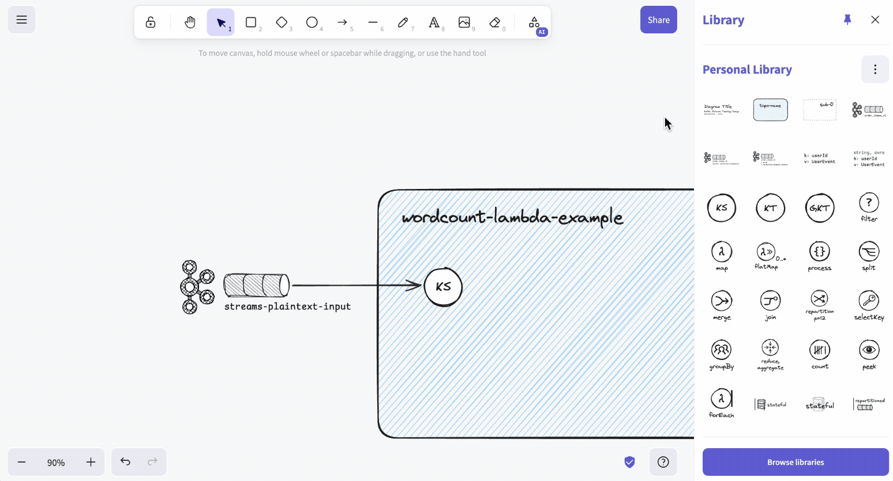
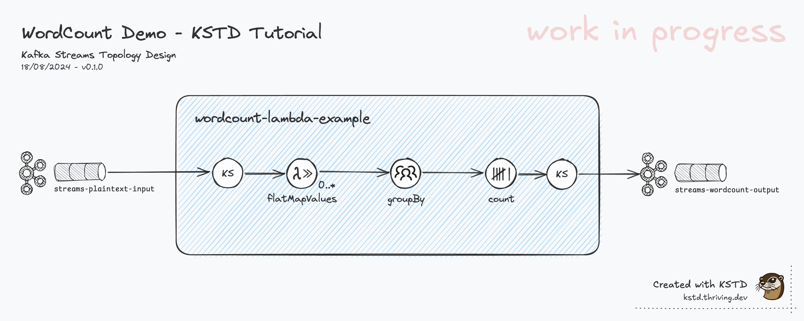
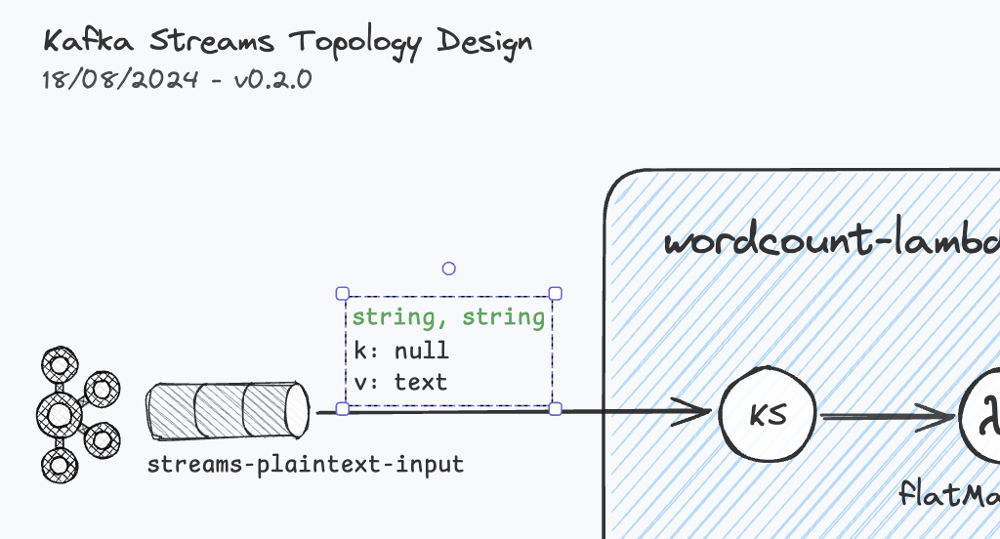
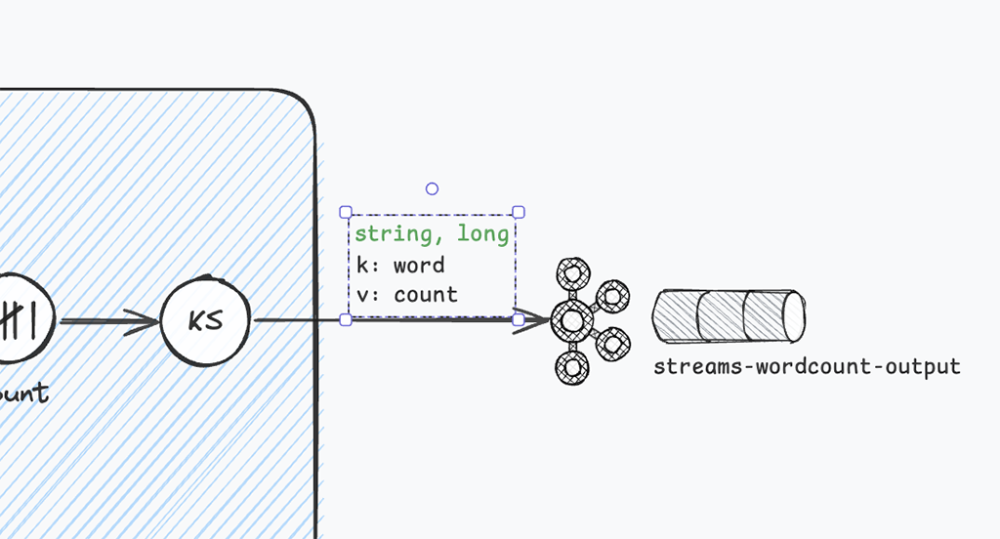
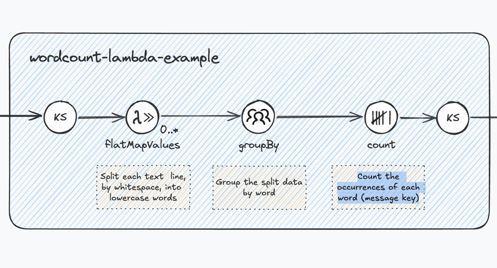
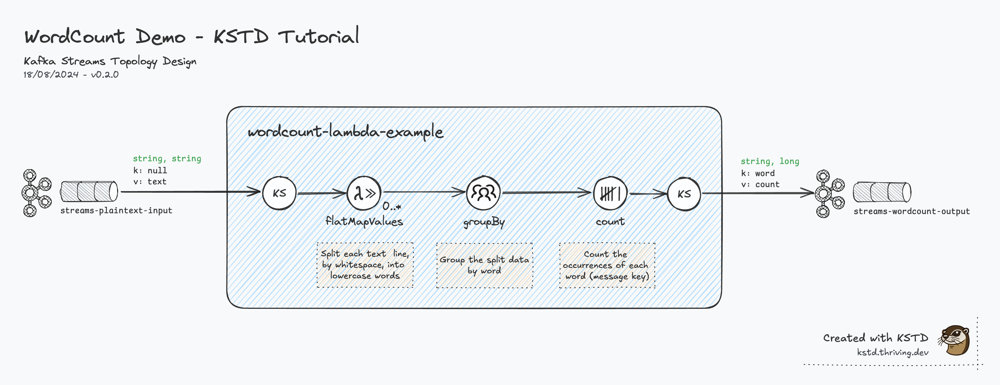

import { Aside } from '@astrojs/starlight/components';
import GlobalMediumZoom from '/src/components/global/GlobalMediumZoom.astro';
import SwiperGallery from '/src/components/SwiperGallery.astro';
import { Icon } from 'astro-icon/components';

# Creating Your First Diagram

To understand the fundamental concepts, we create a Kafka Streams Topology Diagram for the prominent
**'WordCount Demo'** that used to be featured on
[Confluent's Kafka Streams Quick Start](https://docs.confluent.io/platform/6.2/streams/quickstart.html) guide.

Following this tutorial _hands-on_ takes <span class="font-semibold">10-15min</span> and will allow you to
grasp all the basics needed to start crafting diagrams for your own stream processing topologies.
The only prerequisite is to have the KSTD library [installed](/guide/getting-started/).

## Tutorial: 'WordCount Demo'
### Topology Recap

Here's the Java code for the topology, which should be self-explanatory:

```java
// Serializers/deserializers (serde) for String and Long types
final Serde<String> stringSerde = Serdes.String();
final Serde<Long> longSerde = Serdes.Long();

// Construct a `KStream` from the input topic "streams-plaintext-input", where message values
// represent lines of text (for the sake of this example, we ignore whatever may be stored
// in the message keys).
KStream<String, String> textLines = builder.stream("streams-plaintext-input", Consumed.with(stringSerde, stringSerde));

KTable<String, Long> wordCounts = textLines
    // Split each text line, by whitespace, into words.  The text lines are the message
    // values, i.e. we can ignore whatever data is in the message keys and thus invoke
    // `flatMapValues` instead of the more generic `flatMap`.
    .flatMapValues(value -> Arrays.asList(value.toLowerCase().split("\\W+")))
    // We use `groupBy` to ensure the words are available as message keys
    .groupBy((key, value) -> value)
    // Count the occurrences of each word (message key).
    .count();

// Convert the `KTable<String, Long>` into a `KStream<String, Long>` and write to the output topic.
wordCounts.toStream().to("streams-wordcount-output", Produced.with(stringSerde, longSerde));
```

(Full source: [WordCountLambdaExample.java](https://github.com/confluentinc/kafka-streams-examples/blob/v7.7.0/src/main/java/io/confluent/examples/streams/WordCountLambdaExample.java) <Icon name="mdi:github" class="icon !inline-block !-mb-1 w-5 h-5" />)


## Step-by-Step Walkthrough

### Step 1: Topology Container, Source Topic, KStream

First things first, we add a **topology**. Simply drag and drop a new container from the library to the canvas.
Then we give the topology a name: _"wordcount-lambda-example"_.

Next, we add and name out souce **topic** _"streams-plaintext-input"_.

Finally, we add the first DSL component **KStream** (KS) and connect it to the source topic using a _black colored, solid arrow_.


<Aside type="tip" title="Topology name">
    A good practice is to use the `APPLICATION_ID` you are going to configure the application with. Read more on the [KSTD Standard](/guide/kstd-standard/#naming-conventions) page.
</Aside>

### Step 2: Diagram Title, Date, Version

Following the Architecture Diagramming [best practices](/guide/architecture-diagrams-best-practices/), we now add
the most basic diagram metadata: _title_, _date_, and _version_.

To make this as fluent as possible, there's a **header** library component provided.



### Step 3: Processing Steps, Output Topic

In this step, we complete the stream processing flow by adding and connecting the respective **Kafka Streams DSL
components**, strictly following the [#topology-recap](implementation):

<div class="[&>ul>li]:leading-snug">
- flatMapValues
- groupBy
- count
- KStream
</div>

Last but not least, we add, name, and connect the _output **topic**_.


### Step 4: Details, Details, Details!
OK, now we have a diagram showing all processing steps of the 'wordcount-lambda-example' topology, including
its source topic and sink topic.

We give the diagram version the first _minor_ bump to `0.1.0`.<br/>
This is how it looks at this stage:

<div class="images-zoomable">
    
</div>

Rhetorical **questions**:
- Is this version a good and useful diagram?
- Just by looking at the diagram, would you be able to
  - ...how the data streams (in/out) look like? (data types/Serdes, content)
  - ...understand or implement the details of the transformation in the `flatMapValue` step?

The simple **answer: No!!** We'd be _guessing_, making _assumptions_ that might not actually be correct.
This is not what we're aiming for. It effectively makes the diagram useless, if not misleading!

To address this lack of detail, we'll add the **data types** and some basic **content descriptor** for the source and sink
topic, and also **inline description** of the processing steps `flatMapValues`, and `groupBy` - the only steps that have
actual _business logic_ (Java code, passed as lambda functions).

PS: Make use of the KSTD library components available.

<SwiperGallery name="step4" classAppend="!mt-4 py-4 [&>div]:max-w-[600px] flex justify-center items-center">
    <div class="swiper-slide"></div>
    <div class="swiper-slide"></div>
    <div class="swiper-slide"></div>
</SwiperGallery>

The input topic `"streams-plaintext-input"` has records with typically _null_ keys, and values with arbitrary 'text'.
According to the [implementation](#topology-recap), a `stringSerde` is used for both _key_ and _value_.

Data published to the output topic, the result of the `groupBy` + `count` processing steps,
have a _string_ key (the word), and a _long_ value (the number of the word's occurrences).

Last, but not least, we add _concise descriptions_ for the processing steps. This will help the viewer to understand
what's happening throughout the stream processing pipeline, without the need to verbally describe this
(communication overhead), or having to look at the source code.

### Final Result
Here's a final version of the Kafka Streams topology diagram as version `0.2.0`:

<div class="images-zoomable">
    
</div>

This wraps up this simple tutorial.

## Conclusions, Next Steps

Having created your first diagram hands-on should give an initial idea on how to lay out and structure a KSTD diagram.
Move on to the next section to learn all about the standard.

## Bonus: Improving the WordCount Demo Topology
Coming soon...

<GlobalMediumZoom />
