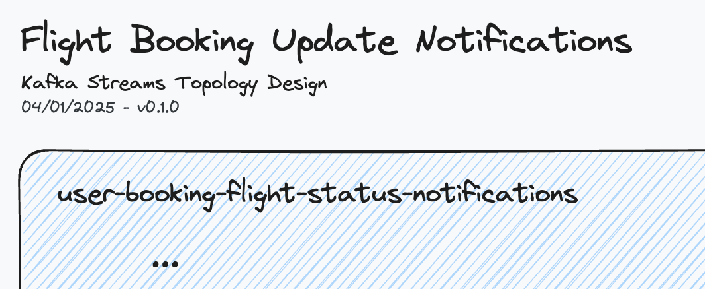
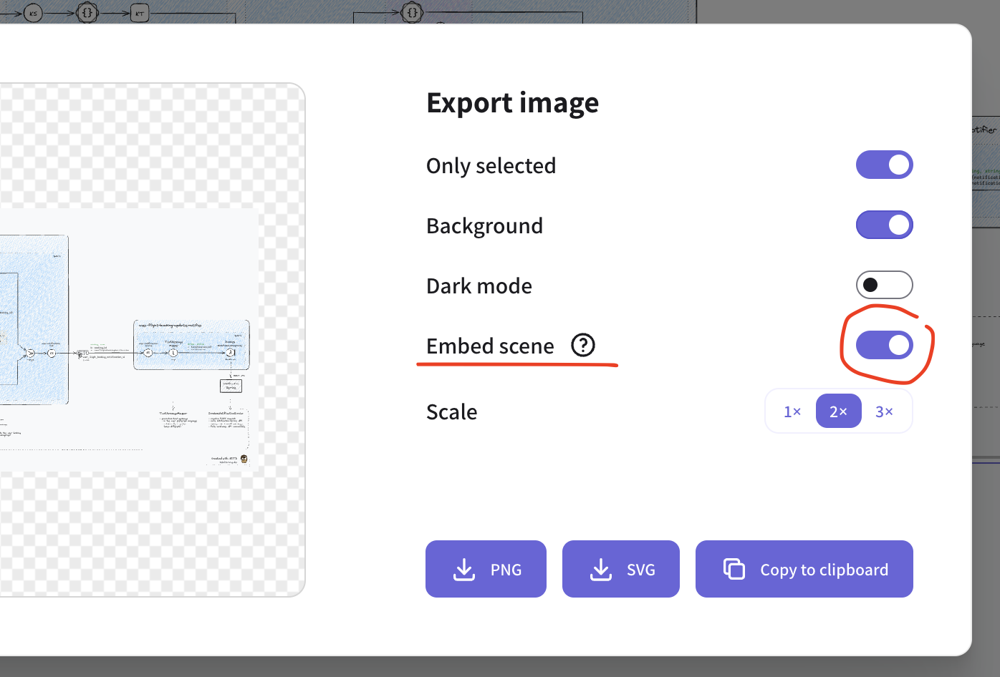

import { AstroFancybox } from '/src/components';

  # {frontmatter.title}

  Enhance your diagramming process with practical tips on versioning, work-in-progress patterns, and exporting scenes using Excalidraw.
  Effectively manage diagram history and optimize your files with embedded scene exports.

  ## Diagram Versioning

  Versioning technical diagrams enables traceability, change tracking, collaborative editing,
  aligns diagrams with evolving design states while maintaining documentation accuracy.

  ### Diagram History: Keeping Minor Iterations on the Canvas

  As you progress with the design and introduce _minor_ or _major_ changes, it's a good pattern to just clone the entire previous minor diagram to a new draft right below and bump the diagram version in the header.

  > E.g. this is how my latest excalidraw WIP document looks like: 
  > <AstroFancybox image="/assets/guide/tips-and-tricks/example-with-history_1.png" imagePreview="/assets/guide/tips-and-tricks/example-with-history_1-preview.png" width={6701} height={8084} classAppend="!my-4" caption="Example: WIP document with progress history" alt="KSTD Docs, Tips & Tricks, WIP document with progress history"/>
  > (`kstd-example_user-booking-flight-status-notifications_WIP.excalidraw`)
  >
  > ☝️ The diagram was cloned for each minor version bump.

  This works fine with the filename rotation pattern introduced above, you just keep a history as you progress with the design for reference.

  ### Versioning Patterns
  Choose any versioning pattern of your choice. 
  Prominent examples are:

  ##### SemVer (Semantic Versioning)
  Format: **MAJOR.MINOR.PATCH** 
  Example: **2.3.1** 
  Usage: Increment major for breaking changes, minor for backward-compatible features, and patch for bugfixes or small improvements. 
  _*used in all examples on the KSTD website._

  ##### CalVer (Calendar Versioning)
  Format: **YYYY.MAJOR.MINOR** 
  Example: **2024.1.2** 
  Usage: Combines time-based and traditional versioning.

  ##### Sequential Versioning
  Format: **Incremental numbers** 
  Example: **1, 2, 3** 
  Usage: Simple systems or firmware (e.g., v5).

  ### 'Work-in-Progress' Pattern
  Working with Excalidraw, or Excalidraw+, there's no support for an automated 'release process' or similar.
  So since it's a manual process, the recommendation is to keep it simple.

  The following patterns are just a suggestion of the author to make live easier.

  When actively working and progressing on architecture diagrams, there's always a current/latest working status.
  It's called the **_work-in-progress_** state, abbreviated as **WIP**.

  #### Saving to Disk & Filename Rotation
  **Let's work with at a simple example**
  > The topology design for the application _'ecommerce-product-view'_

  Starting form a blank canvas, we start working on a new diagram, adding the following header and topology,
  incl. _title_, _date_, and set the new **target version** we're currently working on: **`v0.1.0`**:

  

    
  

  This is our _WIP_ document we're always going to work on. We save this under a filename with the suffix **`*_WIP`** 
  > `user-booking-flight-status-notifications_WIP.excalidraw`

  Once we have finished a first 'complete' _draft_, we proceed with _the "release"_ of **v0.1.0** as follows:
  1. save the document to disk 
     (`user-booking-flight-status-notifications_WIP.excalidraw`)
  2. in the file system, make a copy of the _WIP file_ with the new name: 
     `user-booking-flight-status-notifications_v0.1.0.excalidraw`
  3. bump the diagram version (header) in the _WIP file_ still open in Excalidraw to the next patch version `v0.1.1` and keep progressing.

  You can persist the new WIP state at any point in time. When you get to a new complete state, simply repeat this manual "release process".

  #### Version Control Systems (git)
  There's also the option to maintain your `.excalidraw` files in e.g. a git repo as part of your general
  branching, tagging and release process.

  Just note that due to the lack of automation, there's a good chance for the version used in the diagram(s) to deviate from e.g. git tags.

  ## Excalidraw Tips

  ### Export with Embedded Scene

  When exporting your diagrams as PNG or SVG for documentation or to share with colleagues, there's an option to _embed the scene_ into the exported image.

  

  > ℹ️ Scene data will be saved into the exported PNG/SVG file so that the scene can be restored from it. Will increase exported file size.

  Keeping these rich images as part of your technical documentation (e.g. in Confluent) allows for easy recovery and maintenance of the KSTD excalidraw diagrams in the future.

