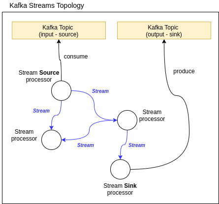
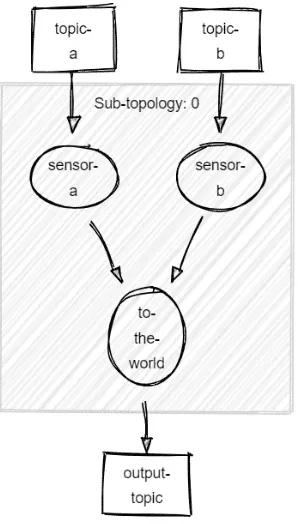
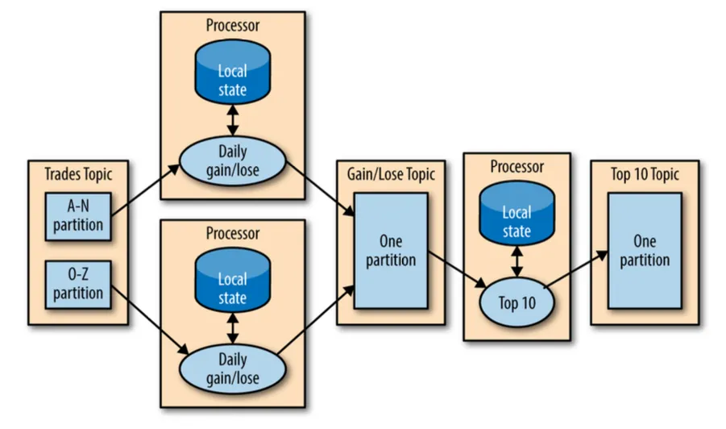
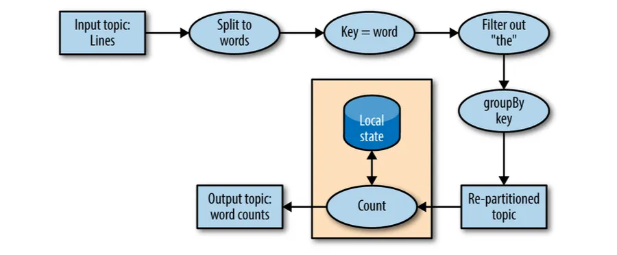
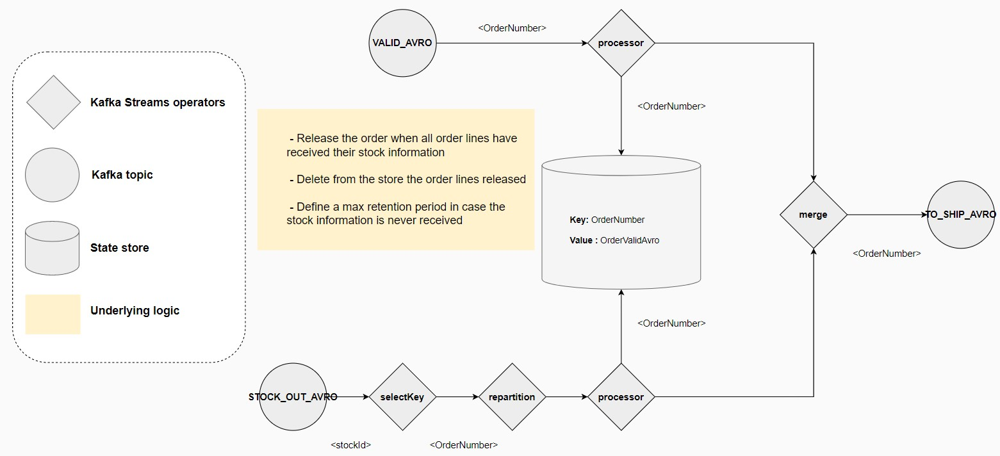
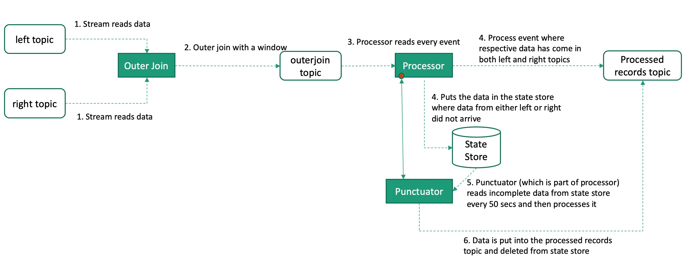
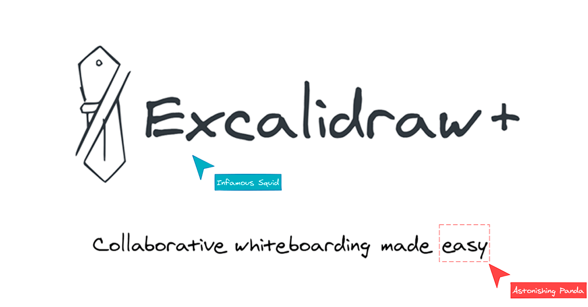
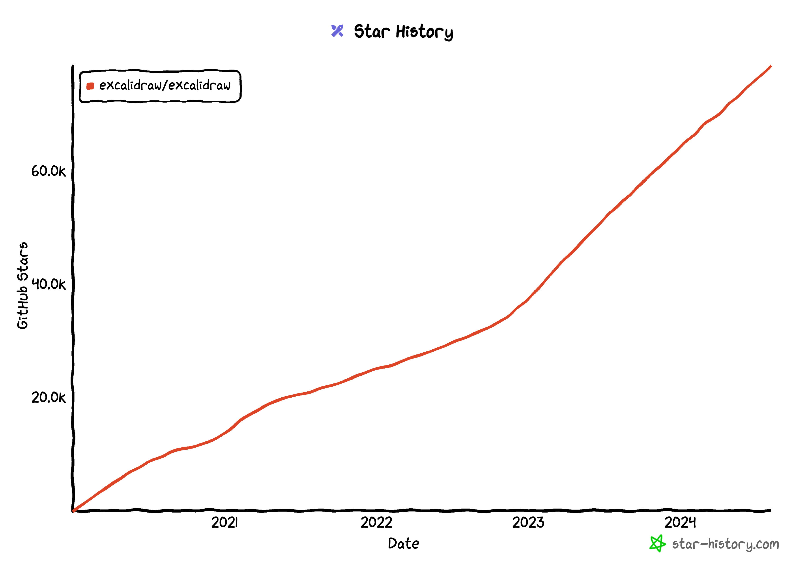

import { Icon } from 'astro-icon/components'
import CallToAction from '@astrojs/starlight/components/CallToAction.astro';
import { Examples, Highlights, Highlight, Hero, Feature, Panel, TwoCols } from '../../components';
import GlobalMediumZoom from '../../components/global/GlobalMediumZoom.astro';
import { globals } from '../../globals';
import AstroFancyCarousel from '../../components/AstroFancyCarousel.astro'

<Hero titleTop="Kafka Streams Topology Design"
      title="The standard for designing and visualising Kafka Streams Topologies"
      tagline="Avoid Mistakes. Save Time. Build Trust. Create High-Quality Designs and Applications!"
      darkImage="../assets/logo1_XL.png"
>
    

        <CallToAction link="/guide/getting-started/" icon={{type: 'icon', name: 'right-arrow'}} variant="primary" set:html="Getting Started" />
        <CallToAction link="/guide/kstd-standard/" icon={{type: 'icon', name: 'right-arrow'}} variant="secondary" set:html="Read the docs" />
        <CallToAction attrs={{class: "minimal", target: "_blank"}} link={globals.lib.install} icon={{type: 'icon', name: 'external'}} set:html="TLDR; Install library" />
    

</Hero>

<Panel classAppend="hidden bg-[var(--sl-color-bg-opt-1)] px-4">
    
div]:!mt-0">
        <a class="no-underline" href="#kafka-streams-topology-design">Introduction</a>
        <a class="no-underline" href="#what-you-get-with-kstd">Features</a>
        <a class="no-underline" href="#what-excalidraw-provides">Excalidraw</a>
        <a class="no-underline" href="#frequently-asked-questions">FAQs</a>
    

</Panel>

<Panel title="What is KSTD?">
    <TwoCols classAppend="grid grid-cols-1 min-[800px]:grid-cols-[_1fr] min-[900px]:grid-cols-[_6fr,_4fr] min-[1100px]:grid-cols-[_7fr,_4fr] !gap-x-10 leading-6 min-[1100px]:leading-7">
        

            [//]: # (
                TODO: Consider adding pause/replay functionality to gif..
                https://github.com/ctrl-freaks/freezeframe.js?tab=readme-ov-file
                https://css-tricks.com/pause-gif-details-summary/
            )

            [//]: # (![test]&#40;../../assets/examples/animated/kafka-streams-topology-design_word-count-example_v1.gif&#41;)
            <video autoPlay muted playsInline loop width="2066" height="1384" class="w-full">
                <source src="/examples/animated/kafka-streams-topology-design_word-count-example_v2.mp4" type="video/mp4" />
            </video>
        

        

            <Feature title="Design Standard"
                     icon="mdi:numeric-1-box"
                     iconColor="text-[var(--sl-color-text-accent)]">
                An open standard for describing and visualising Kafka Stream Topologies.

                [//]: # (Clear guidelines on structuring topology design diagrams, covering everything from basic metadata like)
                [//]: # (name and version to more detailed elements such as state store types and processor descriptions)
                [//]: # (&#40;business logic&#41;.)

                Clear guidelines on crafting diagrams that are descriptive, and self-explanatory.

                It offers best practices for structuring topologies and providing essential context, such as the
                responsibilities of individual processing steps.
            </Feature>
            <Feature title="Excalidraw Library"
                     icon="mdi:numeric-2-box"
                     iconColor="text-[var(--sl-color-text-accent)]">
                A comprehensive component library for the popular drawing tool
                [Excalidraw](https://excalidraw.com), known for creating hand-drawn style diagrams and visualizations.

                It offers full coverage of the Kafka Streams DSL, along with essential infrastructure
                and architectural building blocks, licensed under GPL-3.0.

                [//]: # (KSTD features a comprehensive component library for the popular drawing tool [Excalidraw]&#40;https://excalidraw.com&#41;, published under GPL-3.0.)

                [//]: # (> <Icon name="mdi:clippy" class="icon !inline-block !-mb-1.5 -ml-1 w-6 h-6" /> Excalidraw is a web-based, open-source tool for creating hand-drawn style diagrams and visualizations.)
            </Feature>
        

    </TwoCols>
</Panel>

<Panel classAppend="md:px-8"
       title="Uses and benefits"
       tagline="The structured representation of the data flow and processing logic…"
       centered>
    <TwoCols classAppend="min-[1000px]:grid-cols-3 leading-7 gap-y-5 md:gap-y-6 min-[800px]:!gap-x-8 [&>div>div>div.title]:text-base [&>div>div>div.title]:font-bold [&>div>div>div.icon-outer]:!mr-2 [&>div>div>div.icon-outer]:!-mt-0.5 [&>div>div>div>p>strong]:font-semibold">
        <Feature icon="mdi:check-decagram">
            **Proactive Issue Resolution.**
            Helps identify potential issues, gaps, and design flaws, enabling proactive resolution and more informed decision-making.
        </Feature>
        <Feature>
            **Enhanced Creative Process.**
            Accelerates the creative design process, allowing for rapid progress and effective remote collaboration in whiteboard sessions.
        </Feature>
        <Feature>
            **Shared Understanding.**
            Creates a common ground for teams, fostering shared understanding and alignment, promoting consensus on design decisions.
        </Feature>
        <Feature>
            **Improved Communication.**
            Facilitates communication within and outside development/product teams, and streamlines the onboarding process for new team members.
        </Feature>
        [//]: # (<Feature>)
        [//]: # (    **Clear Stakeholder Communication.**)
        [//]: # (    Effectively conveys complex information, helping stakeholders understand the system’s structure.)
        [//]: # (</Feature>)
        <Feature>
            **Complete Project Lifecycle.**
            From requirements engineering and brainstorming, through technical design, refinement, implementation and testing, to documentation, support, and maintenance.
        </Feature>
        <Feature>
            **Manageable Components.**
            Breaking down complex systems into manageable components makes it easier to understand and work on individual parts. This allows for better planning, estimation, and work splitting.
        </Feature>
    </TwoCols>
</Panel>

<Panel titleTop="Introducing"
       title="Kafka Streams Topology Design">

    [//]: # (TODO: add video/talk here in the future...)

    <TwoCols classAppend="grid !grid-cols-1 min-[900px]:!grid-cols-[_2fr,_1fr] !gap-y-4 gap-x-8">
        

            Software architecture is the blueprint that defines the structure of a software system, defining its
            components, their interactions, and guiding principles to meet technical and business requirements.
        

        

        
blockquote]:py-0.5 [&>blockquote]:ps-6 [&>blockquote]:border-s-[var(--sl-color-text-accent)]">
            > 
"Diagrams must be self descriptive, consistent, accurate enough and connected to the code.
            That’s why it is important that every architect or software engineer rely on several guidelines when
            creating architectural diagrams, since they are the common ground of communicating the application’s
            architecture over time"

            > 

Ionut Balosin

[The Art of Crafting Architectural Diagrams](https://www.infoq.com/articles/crafting-architectural-diagrams/)

        

        

            Tools like UML, ArchiMate, and C4 Model are used to describe software architecture, providing clear
            visual representations that improve understanding, communication, and alignment among stakeholders.

            Surprisingly, there are few, if any, standards and tools available for designing and visually describing
            stream processing applications.

            A search of the web as of August 2024 highlights this gap. You can count the number of diagrams (publicly)
            available describing a Kafka Streams topology on one hand.

            
div]:!mt-0
                        [&>div]:w-full
                        [&>div]:aspect-video
                        [&>div]:border
                        [&>div]:border-[var(--sl-color-gray-5)]
                        [&>div]:rounded
                        [&>div]:!bg-white
                        [&>div>p]:relative
                        [&>div>p]:flex
                        [&>div>p]:justify-center
                        [&>div>p]:items-center
                        [&>div>p]:p-1
                        [&>div>p]:pb-6
                        [&>div>p]:!w-full
                        [&>div>p]:!h-full
                        [&>div>p>span]:absolute
                        [&>div>p>span]:px-2
                        [&>div>p>span]:text-xs
                        [&>div>p>span]:bottom-0
                        [&>div>p>span]:right-0
                        [&>div>p>span>a]:text-gray-800
                        [&>div>p>img]:!max-w-full
                        [&>div>p>img]:!max-h-full
                        [&>div>p>img]:object-contain">
                

                    
                    [[1] Daniel Medeiros de Assis](https://daniel.arneam.com/blog/distributedarchitecture/2020-10-25-Kafka-Streams-Concepts/)
                

                

                    
                    [[2] zz85/kafka-streams-viz](https://github.com/zz85/kafka-streams-viz)
                

                

                    
                    [[3] Neha Narkhede (1)](https://www.alibabacloud.com/blog/595602)
                

                

                    
                    [[4] Neha Narkhede (2)](https://www.alibabacloud.com/blog/595602)
                

                

                    
                    [[5] Michelin Blog](https://github.com/michelin/designing-kafka-streams-applications)
                

                

                    
                    [[6] Redhead Blog, 2020](https://developers.redhat.com/blog/2020/09/28/build-a-data-streaming-pipeline-using-kafka-streams-and-quarkus#the_traditional_messaging_system)
                

            

            What you’ll most often find are basic component integration diagrams and flowchart-derived visuals,
            typically created with standard diagramming tools.

            As Simon Brown, the creator of the [C4 model](https://c4model.com/), aptly calls them, these are often
            just "boxes and lines" diagrams.

            ### KSTD Standard
            The "Kafka Streams Topology Design" open standard was created to provide guidelines and tools for designing and visualizing Kafka Streams topologies. It includes a comprehensive component library for Excalidraw, a drawing tool, allowing users to create clear, self-explanatory diagrams that accurately represent the structure and processing logic of stream processing applications.
        

    </TwoCols>
</Panel>

<Panel classAppend=""
       title="Examples"
       tagline="Inspire Your Designs: Explore Real-World Kafka Streams Topology Examples."
       centered>
    <AstroFancyCarousel images={[
      {
        src: '/assets/examples/kstd-example_ecommerce-product-view_v0.3.1.svg',
        width: 3153,
        height: 1452,
        alt: "'Kafka Streams Topology Design' diagram of an eCommerce example app, producing a full-context 'product view', both as avro and json",
      },
      {
        src: '/assets/examples/kstd-example_user-booking-flight-status-notifications_v0.2.1.svg',
        width: 3720,
        height: 1609,
        alt: "'Kafka Streams Topology Design' diagram of an app processing 'User Flight Booking Status Update Notifications'",
      },
    ]} gallery="examples"/>
    

        You can find more details related to these examples in the [documentation](/guide/examples/).
    

</Panel>

<Panel classAppend="md:px-8"
       title="What you get with KSTD"
       titleTop="Features"
       tagline="From concept to clarity: Kafka Streams development made easy."
       centered>
    <Highlights>
        <Highlight title="Fast whiteboarding sessions" icon="mdi:clock-fast">
            Quickly create clean, visually appealing diagrams, perfect for brainstorming sessions, meetings, and design sprints. Capture and refine ideas swiftly, facilitating efficient and productive creative processes.
        </Highlight>
        <Highlight title="Ease of use" icon="mdi:draw">
            Built on the popular collaborative whiteboard tool [Excalidraw](https://excalidraw.com/), provides an intuitive and user-friendly experience that requires no steep learning curve. You’ll find it easy to start creating and collaborating right away.
        </Highlight>
        <Highlight title="Designated library components" icon="mdi:format-list-bulleted-type">
            The Excalidraw library provides ready-to-use components to describe all aspects of a Kafka Streams Topology. Utilize specialized layout items to add additional information and descriptions of processing logic, enhancing the clarity and functionality of your diagrams.
        </Highlight>
        <Highlight title="Holistic design standard" icon="mdi:progress-star">
            Ensure your diagrams are comprehensive by including all relevant information. Detail topic specifics, record key-value schemata, and functional description of processor nodes within your designs to provide a full picture.
        </Highlight>
    </Highlights>
</Panel>

<Panel title="What Excalidraw provides"
       tagline="Excalidraw is a virtual collaborative whiteboard tool that lets you easily sketch diagrams that have a hand-drawn feel to them."
       centered>
    <TwoCols>
        

            
        

        

            <Feature title="No Installation Required">
                Access Excalidraw directly through your web browser without the need for installation. Once loaded, it can function offline, providing flexibility and convenience for users on the go.
            </Feature>
            <Feature title="Secure Live Collaboration">
                Collaborate in real time with multiple users on the same drawing. Ideal for team brainstorming sessions and remote work, with end-to-end encrypted sessions ensuring your data remains secure.
            </Feature>
        

    </TwoCols>
    <TwoCols classAppend="!mt-4 md:!mt-12">
        

            
        

        

            <Feature title="Save/Open in Native Excalidraw Format">
                Manage your work efficiently by saving and opening diagrams in the native Excalidraw format. This feature supports version control, making collaboration and project management seamless.
            </Feature>
            <Feature title="Various Export Formats">
                Export your diagrams in multiple formats such as PNG, SVG, and others. This versatility ensures that you can easily incorporate your diagrams into presentations, documents, or share them with colleagues and stakeholders.
            </Feature>
            <Feature title="Privacy and Security">
                As an open-source tool that can be self-hosted, Excalidraw offers enhanced control over your data. This ensures greater privacy and security, allowing you to safeguard sensitive information.
            </Feature>
        

        

            
        

    </TwoCols>
</Panel>

<Panel
    title="Boost your productivity. Start using KS Topology Design today."
    tagline="Avoid Mistakes. Save Time. Build Trust. Create High-Quality Designs & Applications!"
    centered>
    
a]:!inline-flex">
        <CallToAction link="/guide/getting-started/" variant="primary" set:html="Get started" />
        <CallToAction link="/guide/kstd-standard/" icon={{type: 'icon', name: 'right-arrow'}} variant="external" set:html="Learn more" />
    

</Panel>

<Panel classAppend="md:px-8"
       title="Frequently Asked Questions"
       tagline={`Have a different question and can’t find the answer you’re looking for? Please feel free to ask your question on <a href='${globals.github}/discussions'>GitHub Discussions</a>.`}
       centered>
    <TwoCols classAppend="leading-6 gap-y-6 md:gap-y-8 md:!gap-x-12
                          [&>div>div>div.title]:text-base
                          [&>div>div>div.content]:text-md
                          [&>div>div>div>svg.icon]:scale-90
                          [&>div>div>div.icon-outer]:!mr-0
                          [&>div>div>div.icon-outer]:!-mt-1
                          [&>div>div>div>p>strong]:font-semibold">
        <Highlight title="What's the inspiration behind the KSTD standard?"
                   icon="mdi:chevron-right">
            **Kafka Streams Topology Design** is a
            <a class="!inline-block text-nowrap" href={globals.linkedin} target="_blank">Thriving.dev</a> project created by
            <a class="!inline-block text-nowrap" href={globals.linkedin} target="_blank">Hartmut Armbruster <Icon name="mdi:linkedin" class="icon !inline-block !-mb-1 w-5 h-5" /></a>,
            a software developer and architect, to craft and communicate Kafka Streams topologies.

            Over the years, it has evolved and been refined through extensive use across various industries,
            proving to be an effective and valuable tool.

            From experience, many teams had previously relied on only high-level diagrams (if any), often jumping into code without fully grasping the implications and risks, leading to time-consuming refactoring or even project failure.

            Visualizing ideas and creating descriptive designs for stream processing applications is no trivial task. The KSTD standard aims to provide valuable guidelines and tools to the Kafka Streams community in overcoming these challenges.
        </Highlight>
        <Highlight title="We have multiple Kafka Streams apps; Should we put them in one Excalidraw board, or keep them separate?"
                   icon="mdi:chevron-right">
            The KSTD standard does not prohibit or restrict the inclusion of multiple topologies or applications
            within a single diagram.

            However, [clarity](/guide/design-principles/) should always be your priority.
            **Focus on presenting what’s most important** to the viewer. If it’s crucial to display multiple topologies
            side-by-side to illustrate how they work together and provide a complete picture, then feel free to do so.

            [//]: # (Take notice there's also the notion ['Master Topology']&#40;/guide/kstd-standard/&#41; - an higher level of abstraction, the representation of the business process on a macro level.)

            From a technical perspective, Excalidraw allows you to manage multiple iterations of your topology design
            or even maintain several different topologies within a single _scene_ (whiteboard).
            You can export individual diagrams as needed. For additional guidance, check out the recommendations under
            [Tips and Tricks](/guide/tips-and-tricks).
        </Highlight>
        <Highlight title="Is KSTD used during the design phase, or for documenting existing applications?"
                   icon="mdi:chevron-right">
            **Both!**
            > "Software architecture diagrams are a fantastic way to communicate how you are
            > planning to build a software system (up-front design) or how an existing software
            > system works (retrospective documentation, knowledge sharing, and learning)." 
            > _Source: [InfoQ - C4 Architecture Model](https://www.infoq.com/articles/C4-architecture-model/)_

            For the **design phase**, Excalidraw is a good choice if you want to design quickly.
            The hand-drawn aesthetic encourages fast, freeform sketching, which is perfect for getting ideas down
            quickly without worrying about precision.

            When **combined** with the KSTD library, it enables **rapid and efficient progress**,
            allows to concentrate on designing the topology and refining the stream processing architecture.

            [//]: # (comprehensive collection of components covering the entire Kafka Streams DSL, as well as essential infrastructure and architectural building blocks, it enables rapid and efficient development.)

            In the **later phases** of the project lifecycle, once the topology is established, it becomes invaluable for
            guiding the implementation process. It serves as a go-to documentation resource when discussing changes or
            introducing new features, and facilitates the efficient onboarding of new team members.
        </Highlight>
        <Highlight title="What level of detail should we include in a diagram?"
                   icon="mdi:chevron-right">
            Classic answer: _"It depends..."_

            Are you in the process of sketching, evaluating ideas - or creating architecture documentation?

            **Crafting & maintaining good diagrams takes time and effort.**

            Prefer less, or "just enough", over risk of fragmentation, outdated diagrams.
            Define a weight for a certain diagram; the level of importance. This determines the time (and money) to invest.

            As a rule of thumb: **Start simple, go with the flow.** Only add details to the topology design that affect
            or change the behaviour of the stream processing.

            As an example: There's no need to draw a state store to each KTable or Aggregation.
            It is though on the other hand when you have a _'Global'_ _'InMemory'_ store that is accessed
            via interactive queries by Processors.

            Keeping a balance between cluttered vs. too vague is essential.
            **Add enough text** so it hardly requires additional explanation.
            If it raises more questions than answers, the diagram is not well created.

            You can find more recommendations on _design principles_ and _architecture diagrams_ in the [documentation](/guide/design-principles/).
        </Highlight>
        <Highlight title="Is KSTD free? It's licensed under GPL-3.0, what does that mean?"
                   icon="mdi:chevron-right">
            Yes, the KSTD standard and the Excalidraw library are **free** for personal, as well as for commercial usw.

            > GPL-3.0 is a free software license that allows users to freely use, modify, and share software, ensuring it stays free and open for everyone.

            The source code is openly available on <a href='${globals.github}'>GitHub</a>.
        </Highlight>
        <Highlight title="Can I propose new ideas, features, or contribute to KSTD?"
                   icon="mdi:chevron-right">
            **Absolutely!** Contributions to improve the documentation or are always welcome.
            If you spot something incorrect or missing, feel free to create an issue or submit a pull request.

            For discussing new ideas on library items or posting feature requests, please start a <a href={`${globals.github}/discussions`}>discussion</a>!
        </Highlight>
    </TwoCols>
</Panel>

<Panel titleTop="Next Steps"
       title="KSTD Modeling Language"
       tagline="Coming soon…"
       classAppend="[&>div]:!-mb-0"
       centered>
</Panel>

<GlobalMediumZoom />
